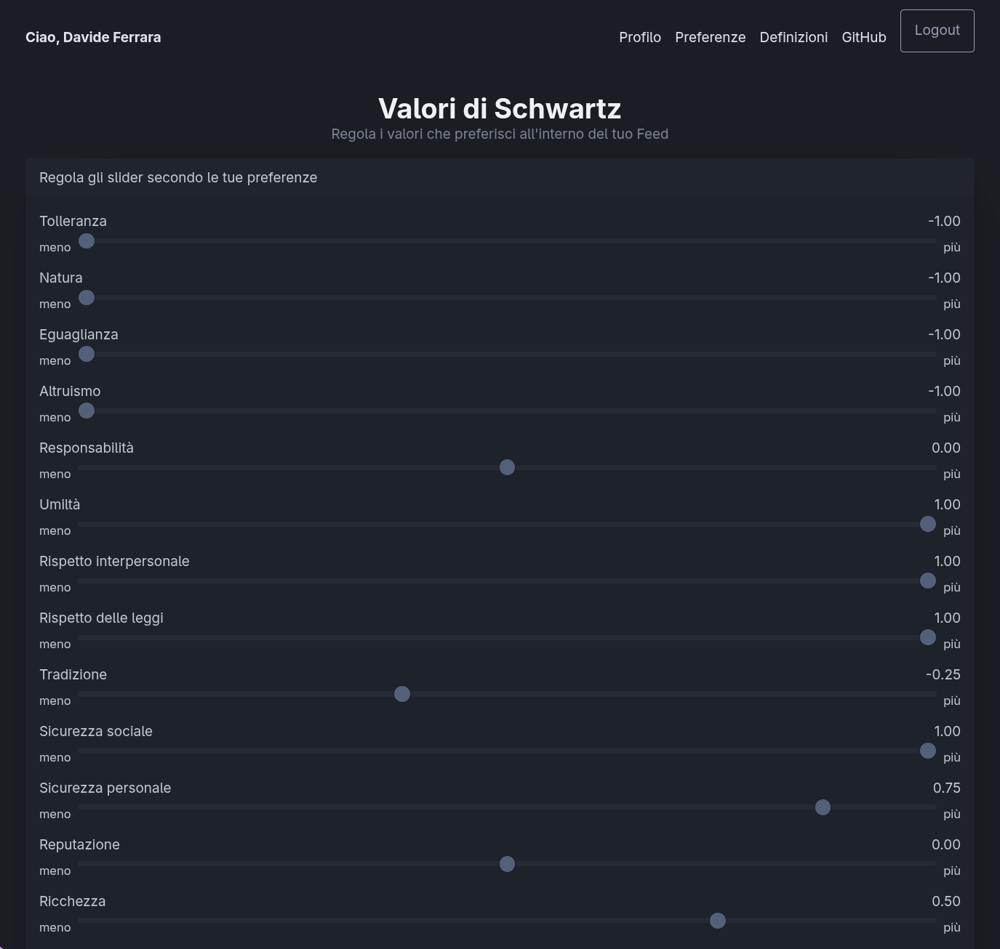
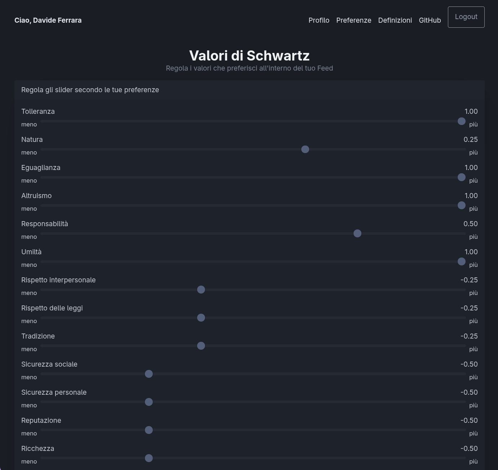

# Bluesky Schwartz

Analisi AI di contenuti social basata sulla Teoria dei Valori Fondamentali di Schwartz (19 valori).

## Cos'è

Analizza post Bluesky usando i 19 valori fondamentali di Schwartz tramite AI. Ogni post viene scored 0-6 per valore, poi pesato per generare feed personalizzati.

## Flusso

```
Post Bluesky → Fetch → AI Analysis → Score → Feed Personalizzato
```

## Screenshots

### Feed Conservatore

| Sliders | Feed |
|---------|------|
|  |  |

### Feed Progressista

| Sliders | Feed |
|---------|------|
|  |  |

## Schema Valori

| Cluster | Valori |
|---------|--------|
| Apertura al Cambiamento | Autodirezione, Stimolazione, Edonismo |
| Autovalorizzazione | Achievement, Potere, Immagine, Ricchezza |
| Conservatorismo | Sicurezza, Conformità, Tradizione |
| Autotrascendenza | Benevolenza, Universalismo, Natura |

19 valori totali (vedi [values_table.png](docs/values_table.png)).

## Utilizzo

```bash
# Raccogli post
./bin/feedgen -n 50 collect-profiles

# Analizza
./bin/feedgen -model=gpt-4o-mini analyze

# Avvia feed
cd feed-service && make run
```

## Setup

```bash
# Variabili ambiente
BSKY_HANDLE=tuo_handle.bsky.social
BSKY_APP_PASSWORD=tua_password
OPEN_ROUTER_KEY=tua_key
```

## Struttura

```
feed-generator/    # CLI
feed-service/      # Server HTTP
data.db           # SQLite
data-analysis/    # Analisi Python
```

## License

MIT